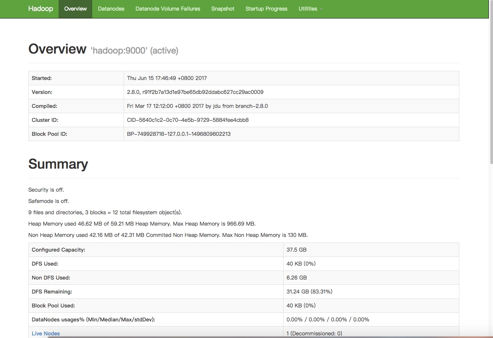
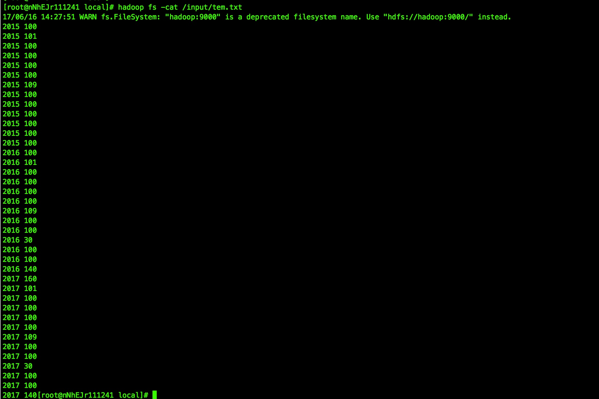
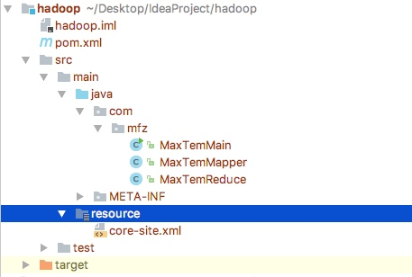
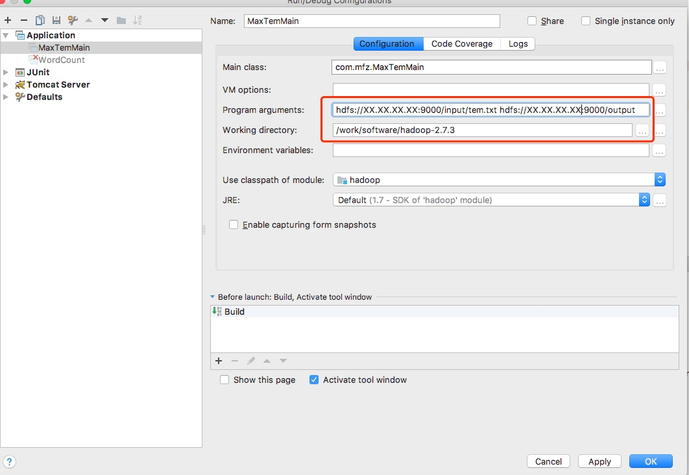
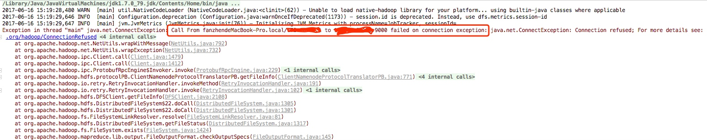
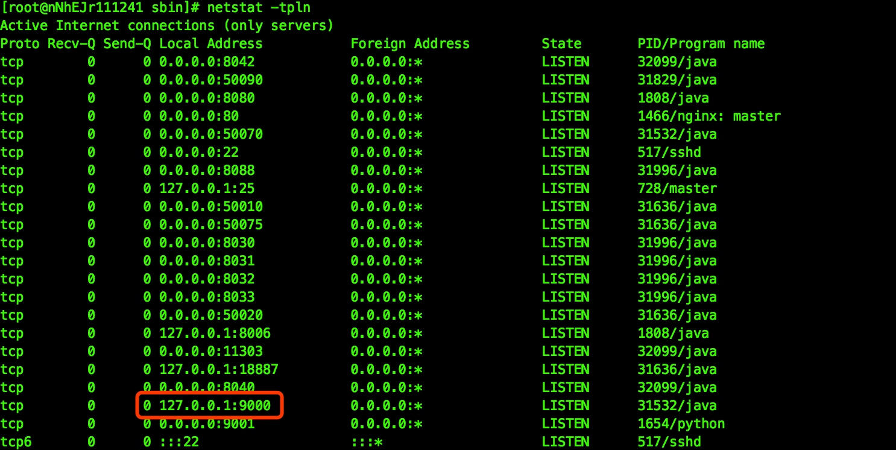
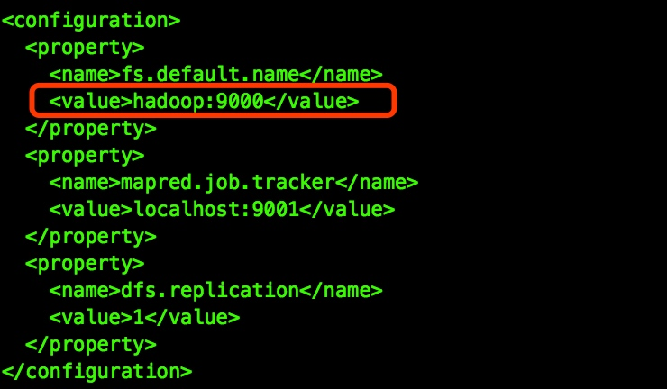
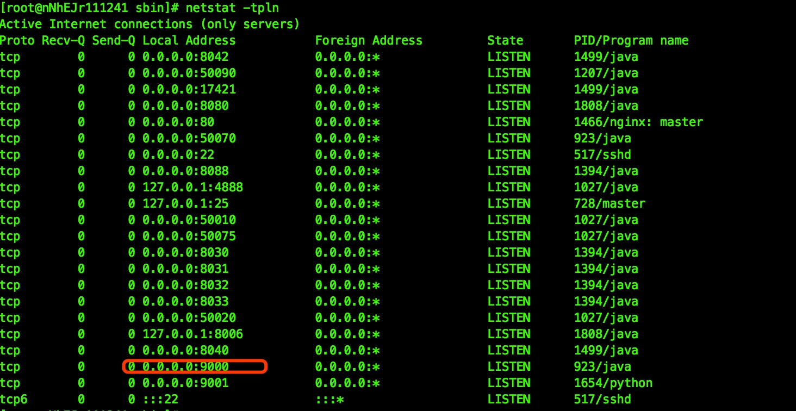
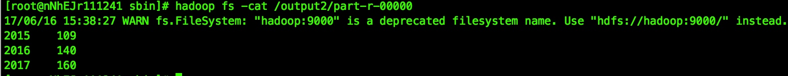

# IDEA远程连接hadoop调试MapReduce（以获取每年的最高气温为例）
准备环境:
* CentOS 7.2 64位（JDK 1.7） 
* hadoop-2.8.0
* IntelliJ IDEA 2016 

1. 在Centos上搭建hadoop环境很简单，在这里就不介绍了，为了保证网络端口的连通性，暂时请将CentOS的防火墙给关掉 ,使用命令`service iptables stop`。由于资源有限，搭建了hadoop的伪分布模式，look下hadoop的WEB管理界面


2. 通过hadoop的命令行的方式将需要分析的文件上传到hadoop的hdfs中input目录下
   
    ```
     hadoop fs -mkdir /input #创建input目录
     hadoop fs -put tem.txt /input  #将本地的tem.txt上传到hdsf的input目录下
    ```
    hadoop的cat的命令来查看上传上去的tem.txt文件的内容（每年的的N多温度，温度有点儿高）
    
1. 在Idea上新建一个hadoop的modual

上代码
（1）创建一个maven项目，引入hadoop客户端相关pom
    
    ```
        <properties>
          <project.build.sourceEncoding>UTF-8</project.build.sourceEncoding>
          <hadoop.version>2.7.2</hadoop.version>
        </properties>
        
        
        <dependencies>
        <dependency>
          <groupId>org.apache.hadoop</groupId>
          <artifactId>hadoop-common</artifactId>
          <version>${hadoop.version}</version>
        </dependency>
        <dependency>
          <groupId>org.apache.hadoop</groupId>
          <artifactId>hadoop-hdfs</artifactId>
          <version>${hadoop.version}</version>
        </dependency>
    
        <dependency>
          <groupId>org.apache.hadoop</groupId>
          <artifactId>hadoop-client</artifactId>
          <version>${hadoop.version}</version>
        </dependency>
    
        <dependency>
          <groupId>junit</groupId>
          <artifactId>junit</artifactId>
          <version>3.8.1</version>
          <scope>test</scope>
        </dependency>
      </dependencies>
    ```
（2）mapper

    ```java    
    import org.apache.hadoop.io.IntWritable;
    import org.apache.hadoop.io.Text;
    import org.apache.hadoop.mapreduce.Mapper;
    
    import java.io.IOException;
    
    
    public class MaxTemMapper extends Mapper {
    
    
        @Override
        protected void map(Object key, Object value, Context context) throws IOException, InterruptedException {
            String text = value.toString();
            String year = text.substring(0,4);
            int tem = Integer.parseInt(text.substring(5));
            context.write(new Text(year),new IntWritable(tem));
        }
    }
    ```
    （3）mapper

    ```java
   import org.apache.hadoop.io.IntWritable;
   import org.apache.hadoop.mapreduce.Reducer;
   
   import java.io.IOException;
   import java.util.Iterator;
   
   /**
    * 获取最高气温的Reduce
    *
    * @author fanzhenmeng
    * @create 2017-06-12 上午11:02
    **/
   public class MaxTemReduce extends Reducer {
   
       @Override
       protected void reduce(Object key, Iterable values, Context context) throws IOException, InterruptedException {
           int maxValue = Integer.MIN_VALUE;
   
   
           Iterator<IntWritable> it = values.iterator();
           while (it.hasNext()){
               IntWritable value = it.next();
               maxValue = Math.max(maxValue,value.get());
           }
           context.write(key,new IntWritable(maxValue));
       }
   
   }
    ```
（4）Main方法

    ```java
    import org.apache.hadoop.conf.Configuration;
    import org.apache.hadoop.fs.Path;
    import org.apache.hadoop.io.IntWritable;
    import org.apache.hadoop.io.Text;
    import org.apache.hadoop.mapreduce.Job;
    import org.apache.hadoop.mapreduce.lib.input.FileInputFormat;
    import org.apache.hadoop.mapreduce.lib.output.FileOutputFormat;
    import org.apache.hadoop.util.GenericOptionsParser;
    

    public class MaxTemMain {
        public static void main(String[] args) throws Exception{
    
            Configuration conf = new Configuration();
            String[] otherArgs = new GenericOptionsParser(conf, args).getRemainingArgs();
            if (otherArgs.length < 2) {
                System.err.println("Usage: wordcount <in> [<in>...] <out>");
                System.exit(2);
            }
            Job job = Job.getInstance(conf, "max tem");
            job.setMapperClass(MaxTemMapper.class);
            job.setCombinerClass(MaxTemReduce.class);
            job.setReducerClass(MaxTemReduce.class);
            job.setOutputKeyClass(Text.class);
            job.setOutputValueClass(IntWritable.class);
            for (int i = 0; i < otherArgs.length - 1; ++i) {
                FileInputFormat.addInputPath(job, new Path(otherArgs[i]));
            }
            FileOutputFormat.setOutputPath(job,
                    new Path(otherArgs[otherArgs.length - 1]));
            System.exit(job.waitForCompletion(true) ? 0 : 1);
        }
    }
    ```
（5）需要拷贝core-site.xml到工程的resouces目录下，这个应该就类似于远程连接数据的连接配置信息吧。需要修改XX.XX.XX.XX改为hadoop的环境的ip地址
    
    ```
    <?xml version="1.0" encoding="UTF-8"?>
    <?xml-stylesheet type="text/xsl" href="configuration.xsl"?>
    <configuration>
        <property>
            <name>fs.defaultFS</name>
            <value>hdfs://XX.XX.XX.XX:9000</value>
        </property>
    </configuration>
    ```

4. 远程连接hadoop，还需要下载一个hadoop的程序放到本地。并配置如下的环境变量
    
    ```
    export HADOOP_HOME=/work/software/hadoop-2.7.3
    export HADOOP_BIN_PATH=/work/software/hadoop-2.7.3/bin
    export HADOOP_PREFIX=/work/software/hadoop-2.7.3
    export PATH=/work/software/hadoop-2.7.3/bin:$PATH
    ```
5. Hadoop服务器端配置
    （1）配置hdfs的权限为false：在hdfs-site.xml中

           <configuration>
               <property>
                   <name>dfs.permissions</name>
                    <value>false</value>
              </property>
           </configuration>
        
6. 配置main参数，配置图中如下参数(分别为hadoop的输入文件和输出目录)，让程序跑起来
        报错了，从堆栈中可以看出，应该是去连接服务器的9000端口悲剧了。telnet一下主机的9000端口果然不通

在CentOS服务器上使用 `netstat -tpln`查询一下端口情况，127.0.0.1:9000 ，9000前面的端口指的是只有127.0.0.1才能连接到9000这个端口，可能是hadoop的安全策略吧。google下


解决端口不通的问题：
    在centos服务器的hosts文件中增加 `0.0.0.0 hadoop `的mapping
    修改服务器的core-site.xml文件中的fs.default.name的value值由localhost改为hadoop，重启hadoop
    
    重启完毕后执行`netstat -tpln`查询一下端口情况,搞定
    
    重新执行main方法，执行成功，look下执行结果 
    


