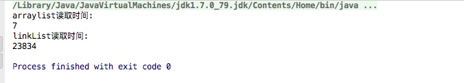
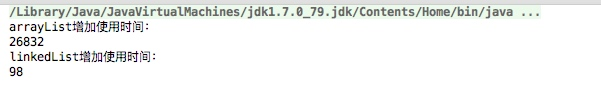

# LinkList 和 ArrayList的效率比较
大家都知道LinkList和ArrayList的区别
1. ArrayList是基于数组的动态实现，LinkList基于链式的数据结构
2. 随机的访问，ArrayList优于LinkList，因为LinkList需要移动指针。
3. 在随机的新增元素方面，LinkList要优于ArrayList。因为ArrayList添加一个元素，后边的元素依次都需要挪动位置。


* 一、通过下边的代码看一下两者之间读取效率的差异

```import java.util.*;


public class TestGetList {
    public static void  main(String[] args){

        int SIZE = 100000;

        ArrayList  arrayList = new ArrayList();
        LinkedList linkedList = new LinkedList();
        Integer[] integerArray = new Integer[SIZE];

        //先给集合赋值
        for (int i = 0; i < SIZE; i++) {
            Random r=new Random();
            Integer val = new Integer(r.nextInt(SIZE)+1);
            integerArray[i] = val;
            arrayList.add(val);
            linkedList.add(val);
        }

        //测试arraylist的读取速度
        long start=System.currentTimeMillis();
        for (int i = 0; i < SIZE; i++) {
            arrayList.get(i);
        }
        System.out.println("arraylist读取时间:");
        System.out.println(System.currentTimeMillis()-start);

        //测试linkedList的读取速度
        start=System.currentTimeMillis();
        for (int i = 0; i < SIZE; i++) {
            linkedList.get(i);
        }
        System.out.println("linkList读取时间:");
        System.out.println(System.currentTimeMillis()-start);

    }

}
```
读取效率的差异还是蛮大的，看下图


* 二、通过如下代码测试两者之间的添加元素效率（以固定添加到0位置为例）

```
import java.util.ArrayList;
import java.util.LinkedList;
import java.util.List;

/**
 * 测试新增元素
 *
 * @author 
 * @create 2017-05-08 下午4:17
 **/
public class TestAdd {
    public static void main(String[] args){
        int SIZE  = 500000;

        //测试arrayList添加
        List arrayList = new ArrayList();
        long start=System.currentTimeMillis();
        for (int i = 0; i < SIZE; i++) {
            Object obj = new Object();
            arrayList.add(0,obj);
        }
        System.out.println("arrayList增加使用时间：");
        System.out.println(System.currentTimeMillis()-start);

        //测试linkList添加
        List linkedList = new LinkedList();
        start=System.currentTimeMillis();
        for (int i = 0; i < SIZE; i++) {
            Object obj = new Object();
            linkedList.add(0,obj);
        }
        System.out.println("linkedList增加使用时间：");
        System.out.println(System.currentTimeMillis()-start);
    }
}
```
运行结果如下：



