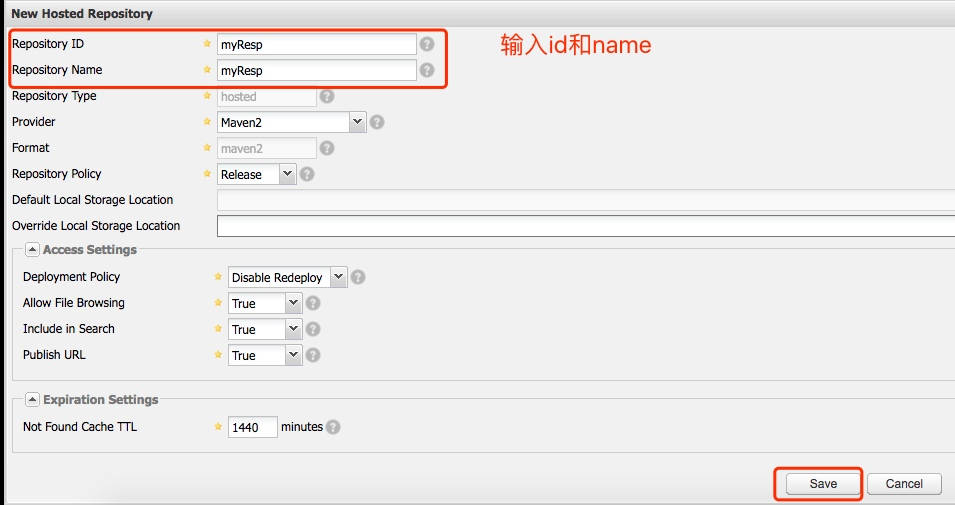

# 使用nexus搭建私库
这两天使用nexus搭建了一个maven的私库。从网上查资料了解到，搭建私库的的场景：
1. 如果公司离不能上外网，则不能从maven的中央仓库下载所需要的jar包，另外网速慢也会影响下工程的构建速度。
2. 企业的jar在中央仓库里是没有的，所以下载不到
因此用户可以用nuxus创建自己的私库来解决以上的场景问题，下面总结一下nexus的搭建步骤:
###### 一、 在linux主机下载zip包
下载地址：http://www.sonatype.org/nexus/go
我是通过执行如下命令下载
`wget http://www.sonatype.org/downloads/nexus-latest-bundle.tar.gz `
解压包
`tar -zxvf nexus-latest-bundle.tar.gz`
解压完成完成

###### 二、 启动服务
 进入nexus-2.14.4-03/bin 目录下执行./nexus start (为了方便启动服务，建议将bin目录加到path中)
 本人是root用户启动的服务，在启动的时候会提示在环境变量里增加RUN_AS_USER=root。
 
启动成功，可以登录web端的管理界面http://主机ip:8081/nexus ，如果访问不了，请检查下主机的防火墙是否关闭

点击右上角的log in ,登录进去，默认账号:admin/admin123
点击左侧的Repositories

nexus默认内置了几个respository,如下：
Public Repositories      仓库组,包含多个仓库
3rd part                     三方库，可以上传jar包到这个仓库
Central                      maven中心仓库
Releases                    自己项目中发布的构建 
Snapshots                 trunk 下开发一个项目

###### 三、 新增自己的仓库，上传自己的jar包




新增完毕，在pom.xml中增加仓库

```
    <repositories>
    <repository>
        <id>mvnrepository</id>
        <name>mvnrepository</name>
        <url>http://mengfanzhen.xyz:8081/nexus/content/repositories/myResp</url>
        <layout>default</layout>
        <releases>
            <enabled>true</enabled>
        </releases>
        <snapshots>
            <enabled>false</enabled>
        </snapshots>
    </repository>
    </repositories>

```
url对应 Resposity Path。大功告成！！

