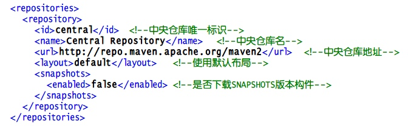

# 配置maven的远程仓库地址
1. maven默认的远程仓库是在%MAVEN_HOME%/lib/maven-model-builder-3.2.1.jar,打开 org/apache/maven/model/pom-4.0.0.xml 超级POM：


  当中央仓库找不到所需要的构建时，我们可以配置pom.xml，添加其他的远程仓库地址

```
<repositories>
    <repository>
        <id>Sonatype</id>
        <name>Sonatype Repository</name>
        <url>http://repository.sonatype.org/content/groups/public/</url>
        <layout>default</layout>
        <releases>
            <enabled>true</enabled>
        </releases>
        <snapshots>
            <enabled>false</enabled>
        </snapshots>
    </repository>
</repositories>
```

2. 镜像仓库，就是资源情况跟中央仓库相同的仓库，使用场景是考虑网络情况，使用当前网络比较快的镜像仓库，如果说中国的仓库

```
 <mirrors>
 4         <mirror>
 5             <id>maven.net.cn</id>
 6             <name>central mirror in china</name>
 7             <url>http://maven.net.cn/content/groups/public</url>
 8             <mirrorOf>central</mirrorOf>    <!--表明为central中央仓库配置镜像仓库-->
 9         </mirror>
10     </mirrors>
```

